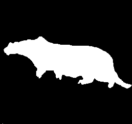

# statistical-learning-image-classification

## Objective
The goal is to segment the “cheetah” image (shown below in the left) into its two components, cheetah (foreground aka FG) and grass
(background aka BG)

|  |  |
|:---:|:---:|
| Test Image | Test Image Ground Truth |

## Data pre-processing

To formulate this as a pattern recognition problem, we need to decide on an observation space. Here
the space of 8×8 image blocks is used as the obs. space, i.e. each image is viewed as a collection of 8×8 blocks.
For each block the discrete cosine transform (function dct2 on MATLAB) is computed and an array of 8 × 8 frequency coefficients is obtained. Because the cheetah and the grass have different textures with different frequency decompositions, the two classes should be better separated in the frequency domain.

The file data/train/TrainingSamplesDCT_8.mat contains a training set of vectors obtained from a similar image (stored as a matrix, each row is a training vector) for each of the classes. There are two matrices, TrainsampleDCT BG and TrainsampleDCT FG for foreground
and background samples respectively

## Algorithms and Approach :
## 1. Maximum Likelihood Estimation
### 1.1 Class Conditional and Marginal Distributions
The two classes are the foreground (cheetah) and the background(grass). [x = x1 , x2, ... , xm] are the
m features in the feature matrix X , where each m is the number of features and is equal to 64. Each x
is the zigzag and dct transformed training data vector of sample images. By using maximum likelihood
estimationwe obtain an estimate of the mean for the class-conditionals of the two classes PXjY (x|cheetah)
and PXjY (x|grass):

where, X is the feature matrix and n is the number of training samples.
Similarly we obtain the estimate of the variance :

where x is the feature vector and n is the number of training examples.
The transformation matrix A = [0 ... i ... 0 ] is applied the CCD to obtain the marginal distribution,
where i=1 at the appropriate index of the 64 features to obtain the respective marginal densities
### 1.2 Baye's Decision Rule

The Bayesian Decision Rule states the we have to pick the class i which minimizes the Risk associated
by picking the class.For the “0-1” loss the optimal decision rule is the maximum a-posteriori probability
rule.

^*&space;=&space;\arg\max_i&space;P_{X|Y}&space;(x|i)&space;*&space;P_Y&space;(i)\])

Therefore, for a given input feature vector x, the value the class i ( cheetah or grass) which maximizes the
above equation is chosen as the output class. Accordingly the pixel value is coded as ’1’ (FG) or ’0’(BG).

For a multivariate gaussian distribution the solution to the above equation is given as :

where di(x; y) is the mahalanobis distance and alpha_i is a constant.

### 1.3 Single Feature Case
To make the task of estimating the class conditional densities easier, each vector observation x is reduced to a scalar. 
For this, for each vector, we compute the index (position within the vector) of the coefficient that has the 2nd largest energy value (absolute value). This is our observation or feature X. (The reason we do not use the coefficient with the largest energy is that it is always the so-called “DC” coefficient, which contains the mean of the block).

### 1.4 Multi-Feature Case
The 64 DCT coefficients in each image block are used as features. Note that the in the single feature case absolute value of the DCT coefficients were used but in this case the DCT coefficients are used directly.

## 2] Expectation Maximization :

* -- Will Upload Soon -- *
